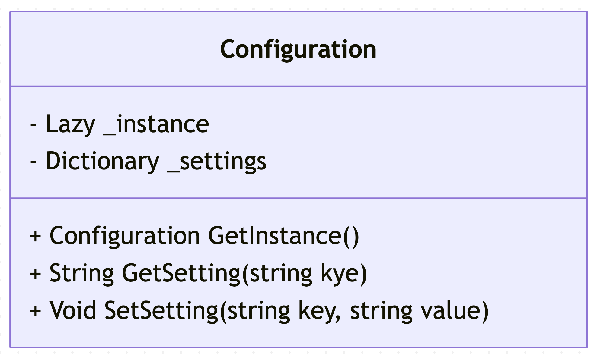

# Examen - Design Patterns - Réponses

## Exercice 1

1.1 Le pattern de conception qui résout ce problème est le Singleton. Ce pattern garantit qu'une classe n'a qu'une seule instance et fournit un point d'accès global à cette instance.

1.2 Diagramme de classes UML :



1.3 Implémentation thread-safe en C# :

```csharp
public class Configuration
{
    private static readonly Lazy<Configuration> _instance =
        new Lazy<Configuration>(() => new Configuration());

    private Dictionary<string, string> _settings = new Dictionary<string, string>();

    private Configuration()
    {
        // Faire des initialisations selon l'envie :)
    }

    public static Configuration GetInstance()
    {
        return _instance.Value;
    }

    public string GetSetting(string key)
    {
        return _settings[key];
    }

    public void SetSetting(string key, string value)
    {
        _settings[key] = value;
    }
}
```

1.4

Pour les avantages, ca garantit qu'il y ait qu'une seule instance et fournit un seul point d'accès global. Par contre, il peut rendre les tests unitaires difficiles et peut introduire des problèmes de concurrence si c'est mal implémenté.

## Exercice 2

2.1 Le pattern utilisé dans ce code est le Factory Method.

2.2 Les participants du pattern sont :

- Vehicule : IVehicle (interface)
- Concrete Vehicule : Car, Motorcycle, Truck (implémentent IVehicle)
- VehicleFactory : VehicleFactory (abstract class)
- Concrete VehicleFactory : CarFactory, MotorcycleFactory, TruckFactory (implémentent VehicleFactory)

2.3 Le rôle de la méthode `OrderVehicle()` est de gérer le processus de commande d'un véhicule. Ce type de méthode s'appelle un template method.

2.4 La différence entre le Factory Method et l'Abstract Factory est que le Factory Method utilise une seule méthode pour créer des objets, l'Abstract Factory fournit une interface pour créer des familles d'objets liés sans spécifier leurs classes concrètes.

## Exercice 3

3.1 Ce que j'ai pu voir :

- Il faudrait que Coffe soit uen interface et qu'il y ait un décorateur abstract qui implémente cette interface.
- Les décorateurs devraient avoir une reférence à un décorateur Coffee.
- Les décorateurs devraient appeler les méthodes de l'objet Coffee qu'il décore pour ajouter son propre comportement.

Voici une version corrigée du code :

```csharp
public interface ICoffee
{
    string GetDescription();
    double GetCost();
}

// Cette classe permet de créer un café simple pour avoir la base du café (un café sans café n'est pas un café)
public class SimpleCoffee : ICoffee
{
    public string GetDescription() => "Café simple";
    public double GetCost() => 2.0;
}

public abstract class CoffeeDecorator : ICoffee
{
    protected ICoffee _coffee;

    public CoffeeDecorator(ICoffee coffee)
    {
        _coffee = coffee;
    }

    public virtual string GetDescription() => _coffee.GetDescription();
    public virtual double GetCost() => _coffee.GetCost();
}

public class MilkDecorator : CoffeeDecorator
{
    public MilkDecorator(ICoffee coffee) : base(coffee) { }

    public override string GetDescription() => _coffee.GetDescription() + ", Lait";
    public override double GetCost() => _coffee.GetCost() + 0.5;
}

public class SugarDecorator : CoffeeDecorator
{
    public SugarDecorator(ICoffee coffee) : base(coffee) { }

    public override string GetDescription() => _coffee.GetDescription() + ", Sucre";
    public override double GetCost() => _coffee.GetCost() + 0.3;
}

public class CaramelDecorator : CoffeeDecorator
{
    public CaramelDecorator(ICoffee coffee) : base(coffee) { }

    public override string GetDescription() => _coffee.GetDescription() + ", Caramel";
    public override double GetCost() => _coffee.GetCost() + 0.8;
}

// Utilisation
class Program
{
    static void Main()
    {
        ICoffee coffee = new SimpleCoffee();
        coffee = new CaramelDecorator(coffee);
        coffee = new MilkDecorator(coffee);
        coffee = new SugarDecorator(coffee);

        Console.WriteLine($"{coffee.GetDescription()} : {coffee.GetCost()}€");
        // Affiche: "Café simple, Caramel, Lait, Sucre : 3.6€"
    }
}
```

## Exercice 4

4.1 On viole le O de SOLID car la classe NotificationService a plusieurs raisons de changer (ajout de nouveaux types de notifications). De plus, le code est difficile à maintenir et à étendre.

4.2 On doit utiliser le pattern Strategy pour séparer les différentes stratégies d'envoi de notifications. Cela permet de respecter le O de SOLID en isolant les comportements dans des classes distinctes et en modifiant `NotificationService` uniquement pour étendre les types de notifications.

Et du coup, je viens de voir que je me suis trompé dans le TP3 (faute avouée à moitié pardonné ?).

4.3

```csharp
public interface INotificationStrategy
{
    void Send(string message);
}

public class EmailNotification : INotificationStrategy
{
    private string _recipient;

    public EmailNotification(string recipient)
    {
        _recipient = recipient;
    }

    public void Send(string message)
    {
        Console.WriteLine($"Connexion au serveur SMTP...");
        Console.WriteLine($"Envoi email à {_recipient}: {message}");
        Console.WriteLine($"Déconnexion SMTP");
    }
}

public class SMSNotification : INotificationStrategy
{
    private string _recipient;

    public SMSNotification(string recipient)
    {
        _recipient = recipient;
    }

    public void Send(string message)
    {
        Console.WriteLine($"Connexion au service SMS...");
        Console.WriteLine($"Envoi SMS à {_recipient}: {message}");
        Console.WriteLine($"Déconnexion du service SMS");
    }
}

public class NotificationService
{
    private INotificationStrategy _notificationStrategy;

    public NotificationService(INotificationStrategy notificationStrategy)
    {
        _notificationStrategy = notificationStrategy;
    }

    public void SendNotification(string message)
    {
        _notificationStrategy.Send(message);
    }
}

// Utilisation
class Program
{
    static void Main()
    {
        var emailService = new NotificationService(new EmailNotification("client@example.com"));
        emailService.SendNotification("Votre commande est prête");

        var smsService = new NotificationService(new SMSNotification("+33612345678"));
        smsService.SendNotification("Code: 1234");
    }
}
```

## Exercice 5

5.1 Le pattern représenté est l'observer

5.2

- IComponent : C'est l'interface qui définit les opérations que les composants concrets doivent implémenter.
- Leaf : C'est une classe concrète qui implémente l'interface IComponent et représente les objets feuilles dans la structure.
- Composite : C'est une classe concrète qui implémente l'interface IComponent et représente les objets composites qui peuvent contenir d'autres composants.

5.3 Ce pattern est très utilisé pour l'UI (MVVM et data binding).

5.4

Première solution : `public void Add(IComponent component);` et pareil pour les 2 autres méthodes.
Deuxième solution : Aucune idée :)
